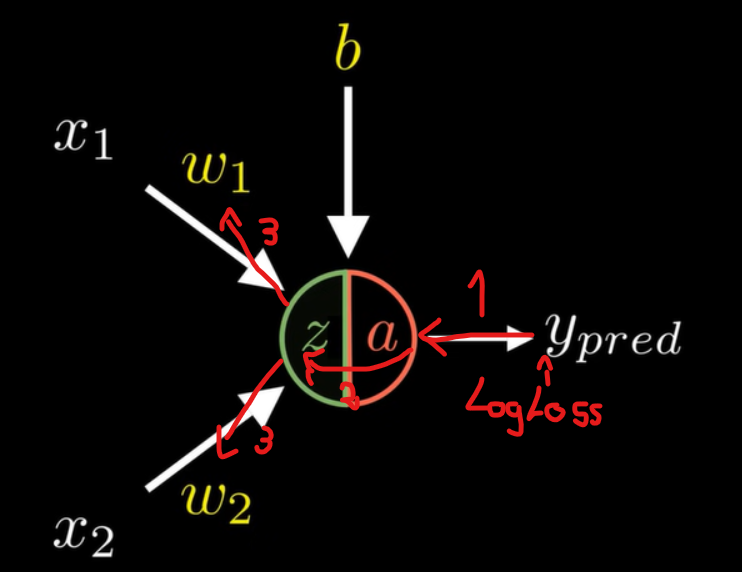
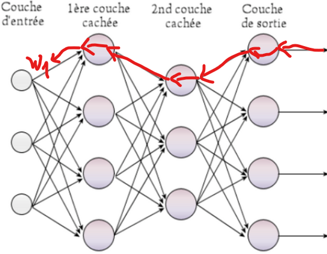

# Origine de la Binary Cross-Entropy function (aussi appellee log loss):

## formule:

E = -1/N * (Somme de n = 1 a N de ( yn * log(pn) + (1 - yn) * log(1 - pn) )) 
Ou N est la taille du data set, yn est le resultat attendu (0 ou 1), et pn est la probabilitee calculee par le modele

Le but est de calculer les pertes du modele en calculant la difference entre les vraies valeures et celles obtenues pas le modele
Pour pouvoir les minimiser via une desscente de gradient.

Mais d'ou vient cette formule ?

En realite, elle est assez simple a comprendre:

On cherche a la base a calculer la vraissemblence de tous les resultats, c'est a dire faire le produit de toutes les probabilitees.

Donc le produit de P(Yn = yn) pour n de 1 a N, ou P(Y = y) est la probabilite que la plante appartienne a la classe y d'apres le model,
y etant sa vraie classe tiree du dataset.

En les multipliant ensemble, on a finalement la probabilitee que le modele donne la bonne reponse pour chaque echantillon du dataset en meme temps.

Nos resultats seront 0 ou 1, on obtient donc ces probabilitees:

P(Y = 1) = a (la probabilitee calculee pas la fonction d'activation, on utilisera la fonction Sigmoïde)
Et reciproquement:
P(Y = 0) = 1 - a

On a :
$$
a = \frac {1} {1 + e^{-z}}
$$
Et
$$
z = w_nx_n + b
$$

On peut ensuite resumer le tout en une seule formule:
P(Y = y) = (a(z) ** y) * ((1 - a(z)) ** 1 - y)
(exemple: P(Y = 1) = (a(z) ** 1) * ((1 - a(z)) ** 0) <=> P(Y = y) = (a(z)) * 1)

Ou z est la sortie du model (input1 * weight1 + input2 * weight2+ ... + inputN * weightN + b).

on remplace a(z) par p pour la lisibilite (p = proba renvoyee pas a(z))
Ensuite, pour multiplier toutes les probabilitees, plus qu'a faire:
L(Likelihood) = Produit de n = 1 a N de (pn ** yn) * ((1 - pn) ** 1 - yn)

Cependant, en faisant un produit de probabilitees, on va se rapprocher de plus en plus de 0 (cat P toujours <= 1),
ce qui peut poser probleme a l'ordinateur pour les calculs au bout d'un moment.

C'est la qu'intervient log(), car log(a * b) = log(a) + log(b) et que log() est une fonction monotonne croissante, 
elle conserve donc l'ordre des thermes.

On peut donc faire cela:
LL = log(L) = log(Produit de n = 1 a N de (pn ** yn) * ((1 - pn) ** 1 - yn))
On ferait donc (log(0.8 * 0.4 * 0.7) = log(0.8) + log(0.4) + log(0.7) + log(0.1) = -1.6498  plutot que 0.8 * 0.4 * 0.7 * 0.1 = 0.0224)

Puisque la fonction log conserve l'ordre des thermes, chercher le max du log de la vraissemblence revient a chercher le 
max de la vraissemblence

Plus qu'a transformer un peu cette formule:

log(Produit de n = 1 a N de (pn ** yn) * ((1 - pn) ** 1 - yn))
<=> Somme de n = 1 a N de log((pn ** yn) * ((1 - pn) ** 1 - yn)) (car logarithme d'un produit equivaut a la somme des logarithmes)
<=> Somme de n = 1 a N de log(pn ** yn) + log((1 - pn) ** 1 - yn) (car encore un produit)
<=> Somme de n = 1 a N de yn * log(pn) + 1 - yn * log((1 - pn)) (car log(x**n) = nlog(x))

Finalement pour arriver a la fonction E, il ne manque que -1/N devant,
Ici on cherchais a faire une maximisation de la vraissemblence, mais en realite, il est plus approprie de minimiser une fonction
on va alors minimiser la fonction inverse qui est logiquement:
-1 * (Somme de n = 1 a N de yn * log(pn) + 1 - yn * log((1 - pn)) (car log(x**n) = nlog(x)))

Puis on divise finalement le tout par N pour normaliser le resultat final, on obtient donc bien:
E = -1/N * (Somme de n = 1 a N de ( yn * log(pn) + (1 - yn) * log(1 - pn) ))

$$
E = -\frac{1}{N} \sum_{n=1}^{N} \left[ y_n \log(p_n) + (1 - y_n) \log(1 - p_n) \right]
$$

#
# Calcul des differentes derivees

On va ensuite calculer les differentes derivees partielles afin de faire ensuite une descente de gradiant, comme dans la regression lineaire, pour minimiser le cout de la fonction log loss

## Derivee de LogLoss par wn

La derivee de L par w1 est egale a la derivee de L par rapport a a (a = fonction d'activation = p(n)), le tout multiplie par la derivee de a par z, et finalement le tout multiplie par la derivee de z par w1.

Car les a et les z se simplifient entre eux ensuite.

Cela donne:

$$
\frac{\partial \mathcal{L}}{\partial \omega_n} 
= 
\frac{\partial \mathcal{L}}{\partial a} 
\times 
\frac{\partial a}{\partial z} 
\times 
\frac{\partial z}{\partial \omega_n}
$$

On commence par calculer 

$$\frac{\partial \mathcal{L}}{\partial a}$$

On recupere
$$
E = -\frac{1}{N} \sum_{n=1}^{N} \left[ y_n \log(p_n) + (1 - y_n) \log(1 - p_n) \right]
$$

On remplace p par a pour que ca soit plus clair:

$$
-\frac{1}{N} \sum_{n=1}^{N} \left[ y_n \log(a_n) + (1 - y_n) \log(1 - a_n) \right]
$$

Les derivees de 
$$
log(a) 
$$
$$
log(1 - a)
$$
sont
$$
\frac {1} {a}
$$

$$
\frac {-1} {1 - a}
$$
car les derivees de log(x) et log(u) sont
$$
\frac {1} {x}
$$
$$
\frac {1} {u}
\times
u'
$$

$$
\frac {\partial \mathcal{L}}{\partial a} = -\frac{1}{N} \sum_{n=1}^{N} \left[ y \frac {1}{a} + (1 - y) \frac {-1}{1-a} \right]
\\
<=>
\frac {\partial \mathcal{L}}{\partial a} = -\frac{1}{N} \sum_{n=1}^{N} \left[\frac {y}{a} -  \frac {1 - y}{1-a} \right]
$$

On peut aussi faire, (a voir si ca change un truc):

$$
\frac {\partial \mathcal{L}}{\partial a} = \frac{1}{N} \sum_{n=1}^{N} \left[\frac {-y}{a} + \frac {1 - y}{1-a} \right]
$$

Ensuite, derivee de 

$$\frac{\partial \mathcal{a}}{\partial z}$$

On a 
$$
a(z) = \frac {1} {1 + e^{-z}}
$$

on peut decomposer sa derivee en
$$
g = \frac {1}{f}
$$
$$
f = 1 + e^{-z}
$$

Donc 
$$
\frac{\partial \mathcal{a}}{\partial z} = g'(f(z)) \times f'(z)
$$

Or 

$$
f' = -e^{-z}
$$
$$
g' = \frac {-1}{f^2}
\\<=>
g' = \frac {-1}{(1 + e^{-z})^2}
$$

Donc

$$
\frac{\partial \mathcal{a}}{\partial z} = \frac {-1}{(1 + e^{-z})^2} \times (-e^{-z})
\\<=>
\frac{\partial \mathcal{a}}{\partial z} = \frac {e^{-z}}{(1 + e^{-z})^2}
\\<=>
\frac{\partial \mathcal{a}}{\partial z} = \frac {1}{1 + e^{-z}}
\times \frac {e^{-z}}{1 + e^{-z}}
\\<=>
\frac{\partial \mathcal{a}}{\partial z} = a \times \frac {e^{-z} + 1 - 1}{1 + e^{-z}}
\\<=>
\frac{\partial \mathcal{a}}{\partial z} = a \times \frac {e^{-z} + 1}{1 + e^{-z}}
+ \frac {- 1}{1 + e^{-z}}
\\<=>
\frac{\partial \mathcal{a}}{\partial z} = a \times (1 - a)
$$

Finalement, on calcule 
$$
\frac{\partial z}{\partial \omega_n}
$$

On a 
$$
z(w_n) = w_nx_n+b
$$

Donc
$$
z'(w_n) = x_n
$$

Recapitulons, nous avons:

$$
\frac {\partial \mathcal{L}}{\partial a} = -\frac{1}{N} \sum_{n=1}^{N} \left[\frac {y}{a} -  \frac {1 - y}{1-a} \right]
$$
$$
\frac{\partial \mathcal{a}}{\partial z} = a \times (1 - a)
$$
$$
\frac{\partial z}{\partial \omega_n} = x_n
$$
On cherchais 

$$
\frac{\partial \mathcal{L}}{\partial \omega_n} 
= 
\frac{\partial \mathcal{L}}{\partial a} 
\times 
\frac{\partial a}{\partial z} 
\times 
\frac{\partial z}{\partial \omega_n}
$$

On a donc finalement

$$
\frac{\partial \mathcal{L}}{\partial \omega_n} = 
(-\frac{1}{N} \sum_{i=1}^{N} \left[\frac {y_i}{a_i} -  \frac {1 - y_i}{1-a_i} \right])
\times a_i \times (1 - a_i)
\times x_n
\\ <=>
\frac{\partial \mathcal{L}}{\partial \omega_n} = 
-\frac{1}{N} \sum_{i=1}^{N} \left[y_i(1-a_i) - (1 - y_i)a_i \right]
\times x_n
\\ <=>
\frac{\partial \mathcal{L}}{\partial \omega_n} = 
-\frac{1}{N} \sum_{i=1}^{N} \left[y_i-y_ia_i - a_i + y_ia_i \right]
\times x_n
\\ <=>
\frac{\partial \mathcal{L}}{\partial \omega_n} = 
-\frac{1}{N} \sum_{i=1}^{N} \left[y_i - a_i \right]
\times x_n
$$

La deuxieme derivee necessaire pour la desscente de gradient est celle par rapport au bias

$$
\frac{\partial \mathcal{L}}{\partial b_n}
$$

On derive donc cela par rapport a b
$$
-\frac{1}{N} \sum_{n=1}^{N} \left[ y_n \log(a_n) + (1 - y_n) \log(1 - a_n) \right]
$$

En suivant la meme logique que precedamment, on a les memes derivees, exceptee la derniere qui devient:

$$
z'(w_n) = 1
$$
car
$$
z = w_nx_n + b
$$

On a donc finalement
$$
\frac{\partial \mathcal{L}}{\partial b_n} = 
-\frac{1}{N} \sum_{i=1}^{N} \left[y_i - a_i \right]
\times 1
\\ <=>
\frac{\partial \mathcal{L}}{\partial b_n} = 
-\frac{1}{N} \sum_{i=1}^{N} \left[y_i - a_i \right]
$$

On a maintenant les 2 derivees necessaires a la desscente de gradient.

## On passe maintenant au Multilayer Perceptron

# Initialisation:

Le mlp prend C couches de n neuronnes

On a donc C-1 (Sans la couche d'input) vecteurs de dimensions (C[i-1], C[i]) = (le nombre de neuronne de la couche precedente (= le nombre d'input), le nombre de neuronne de la couche actuelle) pour les poids (W), chaque neuronne a une liste de poids (1 poids par input) 

Et un vecteur de dimension (1, C[1]) pour les biais (un biais par neuronne)

# Calcul du model

A la place d'un simple calcul comme dans le perceptron, on passe a la Forward Propagation.

On a simplement plusieurs couches de n perceptrons, donc on fait d'abbord la fonction z sur chaque neuronne, puis la sortie de notre neuronne est donc a(z) qui est toujours sigmoide.

Puis toutes ces sorties servent d'input aux neuronnes de la couche suivante etc...

Rien de vraiment complique

# Entrainement du model

On entrainait de base un perceptron grace a son gradient.

On garde la meme technique, mais le calcul des gradient devient plus complexe, car avant on derivait la fonction LogLoss a partir de la sortie d'un simple perceptron, on avait donc cela:

$$
\frac{\partial \mathcal{L}}{\partial \omega_n} 
= 
\frac{\partial \mathcal{L}}{\partial a} 
\times 
\frac{\partial a}{\partial z} 
\times 
\frac{\partial z}{\partial \omega_n}
$$

C'est a dire qu'on pouvait calculer le gradient d'un poid (Wn) en derivant la fonction LogLoss par rapport a 'a', la sortie du perceptron, puis en remontant dans le neuronne en derivant a par rapport z, puis finallement z par rapport a w, ce qui donne finallement la derivee de LogLoss par rapport a w.

(On calcule le loss par rapport a y, puis on remonte jusqu'aux w pour calculer leur gradients)

Sauf que dans un multilayer perceptron, pour remonter jusqu'a un wn[1] par exemple (un poid de la premiere couche), on doit remonter a travers chaque couche.

(Il faut passer par toutes ces etapes de derivation, et plus il y a de couches, plus il y a d'etapes)

Il faut donc trouver un moyen de generaliser le calculs des gradient pour pouvoir mettre a jour les poids et les biais.

Ca s'appelle la BackPropagation

# Calcul de la BackPropagation

Prenons un perceptron a 3 couches (Input layer, 2 hidden layer, output layer) et essayons de calculer les differents gradients

On doit calculer W[1] W[2] W[3] et b[1] b[2] b[3] (pas de poid et biais sur l'input layer)

[n] correspond a la couche n

$$
\frac{\partial \mathcal{L}}{\partial \omega^{[3]}} 
= 
\frac{\partial \mathcal{L}}{\partial a^{[3]}} 
\times 
\frac{\partial a^{[3]}}{\partial z^{[3]}} 
\times 
\frac{\partial z^{[3]}}{\partial \omega^{[3]}}
$$
$$
\frac{\partial \mathcal{L}}{\partial b^{[3]}} 
= 
\frac{\partial \mathcal{L}}{\partial a^{[3]}} 
\times 
\frac{\partial a^{[3]}}{\partial z^{[3]}} 
\times 
\frac{\partial z^{[3]}}{\partial b^{[3]}}
$$

$$
\frac{\partial \mathcal{L}}{\partial \omega^{[2]}} 
= 
\frac{\partial \mathcal{L}}{\partial a^{[3]}} 
\times 
\frac{\partial a^{[3]}}{\partial z^{[3]}} 
\times 
\frac{\partial z^{[3]}}{\partial a^{[2]}}
\times 
\frac{\partial a^{[2]}}{\partial z^{[2]}}
\times 
\frac{\partial z^{[2]}}{\partial \omega^{[2]}}
$$
$$
\frac{\partial \mathcal{L}}{\partial b^{[2]}} 
= 
\frac{\partial \mathcal{L}}{\partial a^{[3]}} 
\times 
\frac{\partial a^{[3]}}{\partial z^{[3]}} 
\times 
\frac{\partial z^{[3]}}{\partial a^{[2]}}
\times 
\frac{\partial a^{[2]}}{\partial z^{[2]}}
\times 
\frac{\partial z^{[2]}}{\partial b^{[2]}}
$$

$$
\frac{\partial \mathcal{L}}{\partial \omega^{[1]}} 
= 
\frac{\partial \mathcal{L}}{\partial a^{[3]}} 
\times 
\frac{\partial a^{[3]}}{\partial z^{[3]}} 
\times 
\frac{\partial z^{[3]}}{\partial a^{[2]}}
\times 
\frac{\partial a^{[2]}}{\partial z^{[2]}}
\times 
\frac{\partial z^{[2]}}{\partial a^{[1]}}
\times 
\frac{\partial a^{[1]}}{\partial z^{[1]}}
\times 
\frac{\partial z^{[1]}}{\partial \omega^{[1]}}
$$
$$
\frac{\partial \mathcal{L}}{\partial b^{[1]}} 
= 
\frac{\partial \mathcal{L}}{\partial a^{[3]}} 
\times 
\frac{\partial a^{[3]}}{\partial z^{[3]}} 
\times 
\frac{\partial z^{[3]}}{\partial a^{[2]}}
\times 
\frac{\partial a^{[2]}}{\partial z^{[2]}}
\times 
\frac{\partial z^{[2]}}{\partial a^{[1]}}
\times 
\frac{\partial a^{[1]}}{\partial z^{[1]}}
\times 
\frac{\partial z^{[1]}}{\partial b^{[1]}}
$$

On voit ces calculs peuvent se decouper comme suit pour simplifier:

$$
dz3
=
\frac{\partial \mathcal{L}}{\partial a^{[3]}} 
\times 
\frac{\partial a^{[3]}}{\partial z^{[3]}} 
$$
$$
dz2
=
dz3
\times
\frac{\partial z^{[3]}}{\partial a^{[2]}}
\times 
\frac{\partial a^{[2]}}{\partial z^{[2]}}
$$
$$
dz1
=
dz3
\times
dz2
\times
\frac{\partial z^{[2]}}{\partial a^{[1]}}
\times 
\frac{\partial a^{[1]}}{\partial z^{[1]}}
$$

On peut donc reecrire:

$$
\frac{\partial \mathcal{L}}{\partial \omega^{[3]}} 
= 
dz3
\times 
\frac{\partial z^{[3]}}{\partial \omega^{[3]}}
$$
$$
\frac{\partial \mathcal{L}}{\partial b^{[3]}} 
= 
dz3
\times 
\frac{\partial z^{[3]}}{\partial b^{[3]}}
$$

$$
\frac{\partial \mathcal{L}}{\partial \omega^{[2]}} 
= 
bz3
\times
bz2 
\times 
\frac{\partial z^{[2]}}{\partial \omega^{[2]}}
$$
$$
\frac{\partial \mathcal{L}}{\partial b^{[2]}} 
= 
bz3
\times
bz2 
\times 
\frac{\partial z^{[2]}}{\partial b^{[2]}}
$$

$$
\frac{\partial \mathcal{L}}{\partial \omega^{[1]}} 
= 
bz3
\times 
bz2
\times 
bz1
\times 
\frac{\partial z^{[1]}}{\partial \omega^{[1]}}
$$
$$
\frac{\partial \mathcal{L}}{\partial b^{[1]}} 
= 
bz3
\times 
bz2
\times 
bz1
\times 
\frac{\partial z^{[1]}}{\partial b^{[1]}}
$$

If faut donc maintenant trouver un moyen de generaliser afin de calculer cela automatiquement

Commencons par calculer les gradients:

On avait deja calcule les derivees necessaires au calcul de dz3 dans le perceptron:

$$
dz3
=
\frac{\partial \mathcal{L}}{\partial a^{[3]}} 
\times 
\frac{\partial a^{[3]}}{\partial z^{[3]}}
\\<=>
dz3
=
\frac{1}{m} \sum_{n=1}^{N} \left[\frac {-y}{a} + \frac {1 - y}{1-a} \right] 
\times
a (1 - a)
\\<=>
dz3
=
\frac{1}{m} \sum_{n=1}^{N} -y (1 - a) + (1 - y) a
\\<=>
dz3
=
\frac{1}{m} \sum_{n=1}^{N} -y + ya + a - ya
\\<=>
dz3
=
\frac{1}{m} \sum_{n=1}^{N} a^{[3]} - y
$$

On enleve juste la somme et le 1/m pour que dz3 ai la bonne dimension, on les reintegrera plus tard pour garder l'integrite du calcul

On a donc:

$$
dz3 = a^{[3]} - y
$$

On peut donc calculer :

$$
\frac{\partial \mathcal{L}}{\partial \omega^{[3]}} 
= 
dz3
\times 
\frac{\partial z^{[3]}}{\partial \omega^{[3]}}
$$

On a :

$$
z^{[3]} = \omega^{[3]}
\times
a^{[2]} + b^{[3]}
$$

Donc: 

$$
\frac{\partial z^{[3]}}{\partial \omega^{[3]}}
=
a^{[2]}
$$

On a donc:

$$
\frac{\partial \mathcal{L}}{\partial \omega^{[3]}} 
= 
dz3
\times 
a^{[2]}
$$

Probleme, on ne peut pas multiplier dz2 (n2, m) et A (n1, m) en raison de leurs dimensions

On peut cependant transposer A, et faire un produit matriciel, ce qui revient finalement au meme

On a donc finalement:

$$
\frac{\partial \mathcal{L}}{\partial \omega^{[3]}} 
=
\frac{1}{m}
dz3
\cdot
a^{[2]^{T}}
$$

On calcule ensuite:

$$
\frac{\partial \mathcal{L}}{\partial b^{[3]}} 
= 
dz3
\times 
\frac{\partial z^{[3]}}{\partial b^{[3]}}
$$

On a :

$$
z^{[3]} = \omega^{[3]}
\times
a^{[2]} + b^{[3]}
$$

Donc

$$
\frac{\partial z^{[3]}}{\partial b^{[3]}}
=
1
$$

On a donc:

$$
\frac{\partial \mathcal{L}}{\partial b^{[3]}} 
= 
dz3
$$

On ajoute pour avoir les bonnes dimensions:

$$
\frac{1}{m}
\sum_{n=1}^{N}
dz3
$$

On passe aux gradients de la couche 2

On a dabbord:

$$
dz2
=
dz3
\times
\frac{\partial z^{[3]}}{\partial a^{[2]}}
\times 
\frac{\partial a^{[2]}}{\partial z^{[2]}}
$$

Or on a:

$$
dz3 = a^{[3]} - y
$$

$$
\frac{\partial z^{[3]}}{\partial a^{[2]}}
=
\omega^{[3]}
$$

$$
\frac{\partial a^{[2]}}{\partial z^{[2]}}
=
a^{[2]}(1 - a^{[2]})
$$

On a donc:

$$
dz2
=
(a^{[3]} - y)
\times
\omega^{[3]}
\times
a^{[2]}(1 - a^{[2]})
$$

On transforme le calcul comme suit pour avoir les bonnes dimensions:

$$
dz2
=
\omega^{[3]^{T}}
\cdot
(a^{[3]} - y)
\times
a^{[2]}(1 - a^{[2]})
$$

On peut donc calculer:

$$
\frac{\partial \mathcal{L}}{\partial \omega^{[2]}} 
= 
dz2
\times 
\frac{\partial z^{[2]}}{\partial \omega^{[2]}}
$$
$$
\frac{\partial \mathcal{L}}{\partial b^{[2]}} 
= 
dz2
\times
\frac{\partial z^{[2]}}{\partial b^{[2]}}
$$

On a :

$$
z^{[2]}
=
\omega^{[2]}
\times
a^{[1]} + b^{[2]}
$$

Donc:

$$
\frac{\partial \mathcal{L}}{\partial \omega^{[2]}} 
= 
\frac {1} {m}
dz2
\times
a^{[1]}
$$

et 

$$
\frac{\partial \mathcal{L}}{\partial b^{[2]}} 
= 
\frac {1} {m}
dz2
$$

Pour avoir les bonnes dimensions, comme precedemment, on fait:

$$
\frac{\partial \mathcal{L}}{\partial \omega^{[2]}} 
= 
\frac {1} {m}
dz2
\cdot
a^{[1]^{T}}
$$

et

$$
\frac{\partial \mathcal{L}}{\partial b^{[2]}} 
=
\frac {1} {m}
\sum_{n=1}^{N}
dz2
$$

Recap, on a donc cela:

$$
dz3 = a^{[3]} - y
$$
$$
d\omega 3
=
\frac{1}{m}
dz3
\cdot
a^{[2]^{T}}
$$
$$
db3
=
\frac{1}{m}
\sum_{n=1}^{N}
dz3
$$

$$
dz2
=
\omega^{[3]^{T}}
\cdot
dz3
\times
a^{[2]}(1 - a^{[2]})
$$
$$
d\omega 2
= 
\frac {1} {m}
dz2
\cdot
a^{[1]^{T}}
$$
$$
db2
=
\frac {1} {m}
\sum_{n=1}^{N}
dz2
$$

Grace a cela, on peut generaliser comme suit:

C = couche actuelle

$$
dz^{[C_finale]}
=
a^{[C_finale]} - y
$$
$$
dW^{[c]}
=
\frac {1} {m}
\times
dz^{[C]}
\cdot
a^{[c-1]^{T}}
$$
$$
db^{[C]}
=
\frac {1} {m}
\sum_{n=1}^{N}
dz^{[C]}
$$
$$
dz^{[C-1]}
=
\omega^{[C]^{T}}
\cdot
dz^{[C]}
\times
a^{[C-1]} (1 - a^{[C-1]})
$$